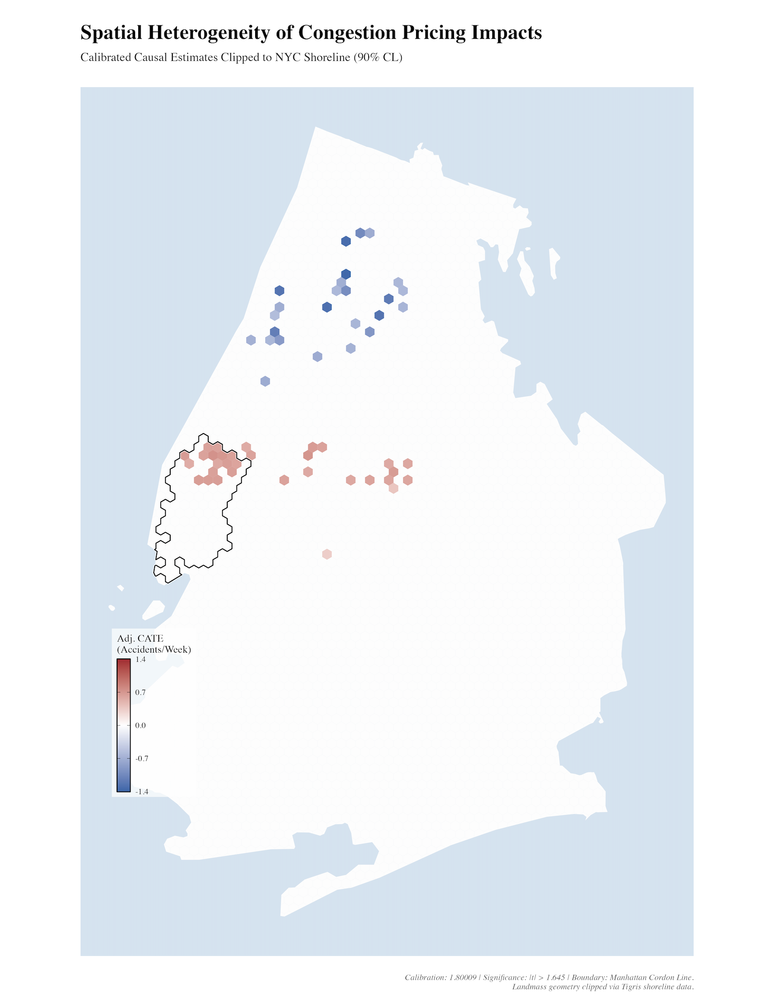
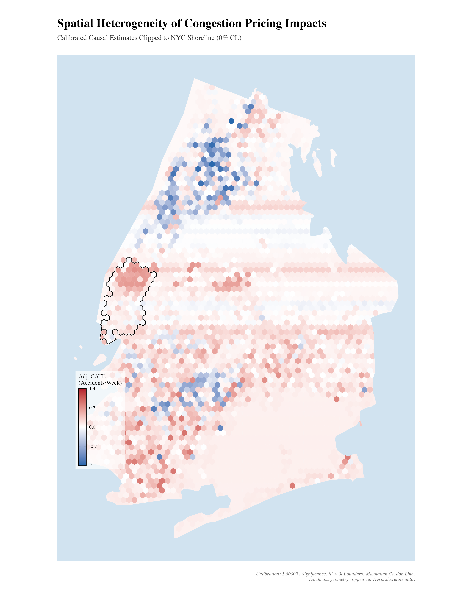

# Heterogeneous Causal Effects of NYC Congestion Pricing
**Local Linear Causal Forests | Spatial Policy Evaluation | R**

---
## Acknowledgments
I thank Peter Christensen for invaluable guidance and Ellie Stoever for contributions to the original difference-in-differences analysis underlying this work.

## Overview

New York City's Congestion Pricing Act took effect on January 5, 2025, imposing a toll on vehicles entering Manhattan below 60th Street. Early difference-in-differences analysis estimated an average reduction of ~20 motor vehicle collisions per week inside the pricing zone, but average treatment effects mask where and when a pricing intervention actually works.

This project estimates **spatially heterogeneous causal effects** of congestion pricing on weekly accident rates across NYC's four-borough road network, using Local Linear Causal Forests (LLCF) developed by Friedberg, Tibshirani, Athey & Wager (2021). Rather than a single borough-level average, the model produces a hex-grid map of calibrated conditional average treatment effects (CATEs), one estimate per spatial unit, over a 62-week post-treatment window.

I then run the same model with weekly average vehicle speed as the outcome variable to explore the relationship between the congestion pricing program and average vehicle speeds across the four-borough road network, and to examine how these estimates compare with the effect of vehicle collisions in each hexagon. I compare my results to those estimated by Economists Hunt Allcott and Shoshana Vasserman (along with researchers from Google and Yale) who found that NYC's congestion pricing program increased speeds on CBD roads by 11%.

---

## Key Findings

- **3,598 hexagonal spatial units** covering the majority of NYC were evaluated
- **57 hexes reached statistical significance** at the 90% confidence level (|t| > 1.645)
- Among significant hexes:
  - **25 showed reductions** in weekly accidents (CATEs ranging from −1.37 to −0.58 accidents/week), concentrated inside and immediately adjacent to the Manhattan cordon
  - **32 showed increases** (CATEs ranging from +0.33 to +0.73 accidents/week), concentrated in the Bronx and along outer-borough arterials, consistent with traffic diversion
- The spatial pattern suggests the policy reduced collisions within the pricing zone while redistributing some accident risk to surrounding areas

---

## Methodology

**Causal Identification**
- Treatment defined as post-January 5, 2025 entry into the congestion pricing zone
- Parallel trends validated across Upper/Lower Manhattan pre-treatment periods
- Unconfoundedness assessed via placebo tests across spatial hex sizes

**LLCF Architecture**
- Separate nuisance forests (`regression_forest`) estimate propensity scores (W.hat) and outcome baselines (Y.hat) before the causal forest is trained, the standard R-learner / partially linear setup from Athey & Wager
- Causal forest trained with `honesty = TRUE`: data split between tree-building and effect-estimation partitions to ensure valid p-values
- Linear correction applied to `y_coord` and `dist_60th` at prediction time to sharpen spatial heterogeneity estimates near the cordon boundary
- Standard errors via infinitesimal jackknife variance estimates; significance threshold |t| > 1.645 (90% CL)
- Dynamic calibration via `test_calibration()`: factor 1.80009 applied to raw CATEs to align predicted effects with observed magnitude
- All forests: 2,000 trees, `tune.parameters = "all"`, clustered by `hex_id`, parallelized across available cores

**Feature Set (X matrix)**

| Feature | Description |
|---|---|
| `baseline_risk` | Pre-treatment mean weekly collisions per hex |
| `y_coord` | Northing (EPSG:2263) north-south spatial gradient |
| `dist_60th` | Distance from 60th Street cordon boundary |
| `week_index` | Continuous time index (weeks since study start) |
| `avg_temp` | Weekly average temperature (°F), nearest NYS Mesonet station |
| `tot_precip` | Weekly total precipitation (inches), nearest NYS Mesonet station |

**Data**
- NYPD Motor Vehicle Collision Reports (Jan 2022 – Apr 2026); Staten Island excluded
- Spatial grid: 1,640-ft hexagonal tessellation clipped to NYC shoreline via TIGRIS (EPSG:2263)
- Treatment zone: official MTA congestion pricing geofence (WKT); hex assignment by centroid intersection
- Weather: NYS Mesonet monthly CSVs; nearest station per hex via `st_nearest_feature`; data access fee waived

**Computation**
- Parallel processing across 64GB RAM local environment
- Post-treatment window: 62 weeks (vs. 10 weeks in prior DiD analysis)

---

## Repository Structure

```
├── ATE_analysis/
│   └── code/
│       └── diff_in_diff             # Original DiD analysis (Upper vs. Lower Manhattan, Co-Author Ellie Stoever)
│
├── HTE_analysis/
│   ├── code/
│   │   ├── Data_Cleaning.R          # Spatial setup, collision panel, weather merge, feature engineering
│   │   └── LLCF_model.R             # Nuisance forests, causal forest, CATE prediction, mapping
│   ├── outputs/
│   │   ├── shapefile                # NYC cordon boundary (MTA geofence)
│   │   ├── Significant_Hexes.png   # Statistically significant CATEs (90% CL)
│   │   ├── All_Hexes.png           # Full spatial distribution (all hexes, no significance filter)
│   │   └── model_output.csv        # Hex-level CATE estimates, SEs, t-stats
│   └── Independent_Study_Introduction.pdf
│
├── Policy_Analysis_SlideDeck.pdf   # In Depth Policy Analysis of the Congestion Pricing Act (2025)
├── Project_Proposal.pdf            # Independent study proposal
├── project_final.pdf               # Final empirical paper (Submission to Advisor by June 15th, 2026)
└── README.md
```

---

## Visualizations

**Statistically Significant CATEs (90% CL)**

*Blue = fewer accidents/week. Red = more accidents/week. Boundary = Manhattan Cordon Line.*

**Full Spatial Distribution (All Hexes)**


---

## Background and Motivation

This project extends a prior difference-in-differences study (Econ 114, UCSC) that suffered from limited post-treatment data (10 weeks) and weak external validity. Moving to LLCF with 62 weeks of post-treatment observations addresses three limitations of the original analysis:

1. **Granularity**: Borough-level averages obscure localized policy impacts
2. **Heterogeneity**: Peak vs. off-peak hours and intersection density drive differential effects that ATE cannot capture
3. **Statistical power**: A 6x longer post-treatment window yields more reliable causal estimates

The LLCF framework is directly applicable to settings where a single average effect is insufficient, including dynamic pricing, demand estimation, and market design contexts where treatment response varies by unit characteristics.

---

## References

- Athey, S. & Wager, S. (2019). *Estimating Treatment Effects with Causal Forests: An Application.* Observational Studies.
- Tibshirani, J., Athey, S., Sverdrup, E., & Wager, S. (2020). *grf: Generalized Random Forests.* R package.
- NYPD Motor Vehicle Collisions – Crashes. NYC Open Data.
- NYS Mesonet Weather Data. University at Albany.
